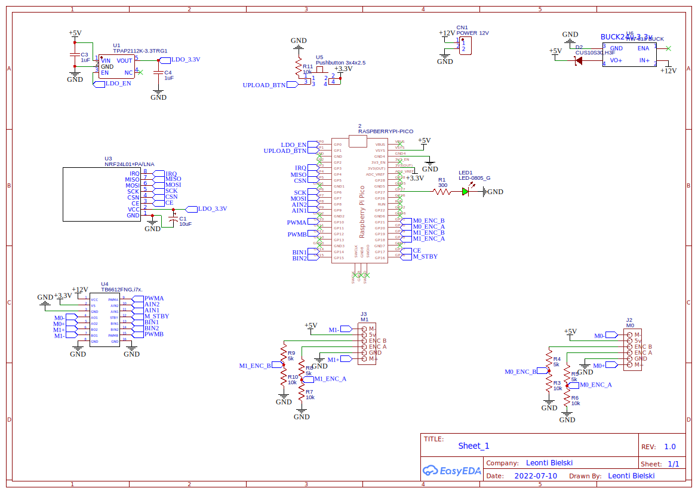
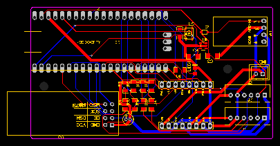

# Roller blinds controller
Pi Pico based controller to control 2 motors with encoders using NRF24L01 for receiving commands.

## Schematic

## PCB

## Power consumption
30mA standby
Approximately 300mA when working, depends on a motor and a roller blind weight.